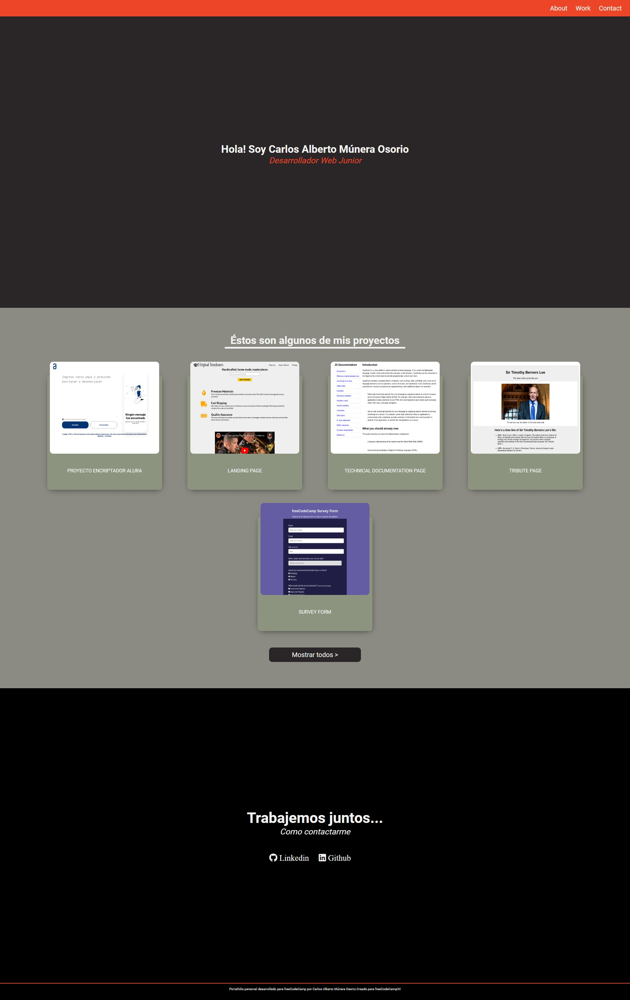

# Proyecto para Certificación RESPONSIVE WEB DESIGN - FreeCodeCamp

## Personal Portfolio Webpage
Objetivo: Construir una aplicación similar a un portafolio.

## Tecnologías Utilizadas:
* HTML5
* CSS3
* Responsive Web Design (CSS Flexbox y CSS Grid).

## Acerca del autor:
* [LinkedIn](https://www.linkedin.com/in/carlos-munera-259969262 "Linkedin")
* [FreeCodeCamp](https://www.freecodecamp.org/fcc0dc40656-86b6-4bd7-a2b0-5ccd1ae5cc31 "FreeCodeCamp")